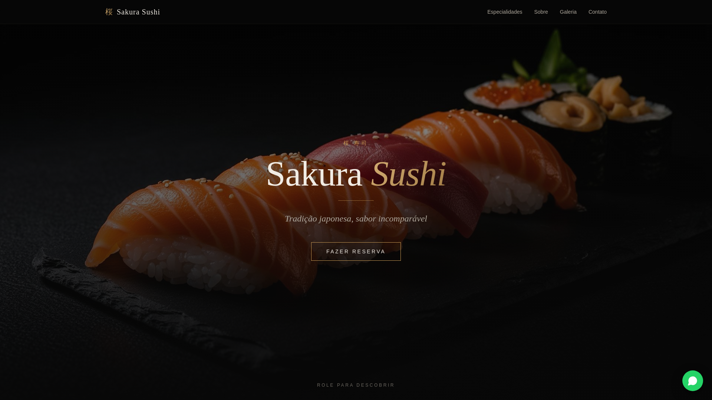

# 🌸 Sakura Sushi

Sugestão de Site de um restaurante de sushi japonês, desenvolvido com foco em design moderno, responsividade e boa experiência do usuário. O projeto simula a presença digital de um restaurante sofisticado, unindo estética oriental com design moderno e responsivo.

# 🍣 Sobre o site
O site apresenta a identidade visual e a proposta do restaurante Sakura Sushi, transmitindo tradição, elegância e uma experiência gastronômica autêntica. Com uma interface clean e intuitiva, o visitante é convidado a explorar o cardápio, conhecer a história do restaurante e entrar em contato para reservas.

🔗 **Deploy:** [matheuscorreiadev.github.io/Sakura-Sushi](https://matheuscorreiadev.github.io/Sakura-Sushi/)

---

## 📸 Preview



---

## 🚀 Tecnologias Utilizadas

### ⚛️ React 18
Biblioteca principal para construção da interface. Toda a estrutura de componentes, páginas e lógica visual do projeto foi desenvolvida com React, aproveitando o modelo de componentes reutilizáveis e o sistema de estado moderno com hooks.

### 🔷 TypeScript
Utilizado em todos os arquivos do projeto (`.tsx` e `.ts`) para garantir tipagem estática, reduzir erros em tempo de desenvolvimento e melhorar a manutenção do código.

### ⚡ Vite
Ferramenta de build e servidor de desenvolvimento. Responsável por compilar o projeto para produção (`npm run build`) e servir a aplicação localmente com hot reload. Também foi configurado com a propriedade `base` para compatibilidade com o GitHub Pages.

### 🎨 Tailwind CSS
Framework de CSS utilitário usado para estilizar toda a interface do projeto. Permite criar layouts responsivos e componentes visualmente consistentes sem sair do HTML/JSX, utilizando classes utilitárias diretamente nos elementos.

### 🧩 shadcn/ui + Radix UI
Biblioteca de componentes acessíveis e estilizáveis. Os componentes como botões, modais, menus, tooltips, tabs, toasts e outros elementos de UI foram construídos com base nos primitivos do Radix UI, integrados via shadcn/ui para facilitar a customização com Tailwind.

### 🛣️ React Router DOM
Gerencia a navegação entre páginas do site. As rotas foram definidas no `App.tsx` com `BrowserRouter` e configuradas com `basename="/Sakura-Sushi"` para funcionar corretamente no GitHub Pages.

### 🔄 TanStack React Query
Utilizado para gerenciamento de dados assíncronos. O `QueryClientProvider` envolve toda a aplicação no `App.tsx`, deixando o projeto preparado para consumir APIs externas com cache, revalidação e controle de estado de carregamento.

### 📋 React Hook Form + Zod
Combinação usada para gerenciamento e validação de formulários. O `react-hook-form` controla os campos e submissões, enquanto o `zod` define os esquemas de validação com tipagem segura via `@hookform/resolvers`.

### 📊 Recharts
Biblioteca de gráficos baseada em React. Disponível no projeto para exibição de dados visuais como gráficos de barras, linhas ou pizza, caso necessário em seções do site.

### 🎠 Embla Carousel
Usado para criar carrosséis e sliders de imagens ou conteúdos na interface, com suporte a touch e animações suaves.

### 🔔 Sonner
Biblioteca de notificações (toasts) utilizada para exibir mensagens de feedback ao usuário, como confirmações e erros, de forma elegante e não intrusiva.

### 🗓️ date-fns + react-day-picker
Utilizados para manipulação e exibição de datas. O `date-fns` fornece utilitários para formatação e cálculo de datas, enquanto o `react-day-picker` oferece um calendário interativo para seleção de datas.

### 🧪 Vitest + Testing Library
Stack de testes do projeto. O `vitest` é o executor de testes compatível com Vite, e o `@testing-library/react` permite escrever testes de componentes simulando o comportamento real do usuário.

### 🚀 GitHub Actions + GitHub Pages
O deploy é feito automaticamente via GitHub Actions. A cada push na branch `main`, o workflow executa o build do projeto e publica o resultado na branch `gh-pages`, que é servida pelo GitHub Pages.

---

## 📦 Como rodar localmente

```bash
# Clone o repositório
git clone https://github.com/matheuscorreiadev/Sakura-Sushi.git

# Entre na pasta
cd Sakura-Sushi

# Instale as dependências
npm install

# Inicie o servidor de desenvolvimento
npm run dev
```

Acesse em: `http://localhost:8080`

---

## 🏗️ Build para produção

```bash
npm run build
```

Os arquivos gerados ficam na pasta `dist/`.

---

## 📁 Estrutura do Projeto

```
Sakura-Sushi/
├── public/              # Arquivos estáticos
├── src/
│   ├── components/      # Componentes reutilizáveis
│   ├── pages/           # Páginas da aplicação
│   ├── App.tsx          # Configuração de rotas
│   ├── main.tsx         # Ponto de entrada
│   └── index.css        # Estilos globais
├── .github/
│   └── workflows/
│       └── deploy.yml   # Pipeline de deploy automático
├── vite.config.ts       # Configuração do Vite
└── package.json
```

---

## 👨‍💻 Autor

Feito por [matheuscorreiadev](https://github.com/matheuscorreiadev)


